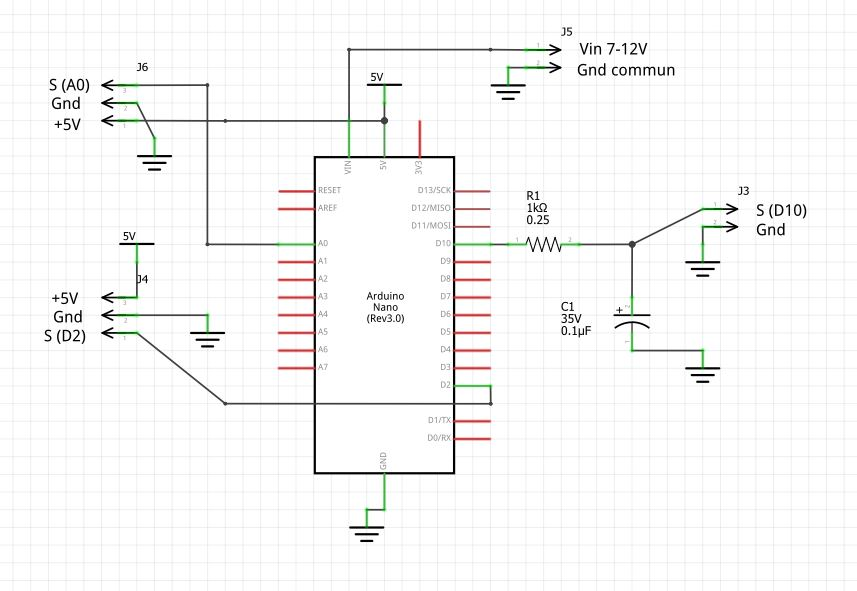

# E-bike PAS to throttle converter

Allows you to install a PAS on e-bikes that do not have this port. For those who already have one managed by the controller, also makes it possible to make the starts much more responsive (!) and offers more possibilities of adjustments. A throttle/accelerator input on the controller is required (if no, see also links below).

Permet d'installer un PAS sur les e-bike ne possédant pas ce port. Pour ceux qui en ont déjà un géré par le controleur, permet également de rendre beaucoup plus réactif les démarages (!) et offre plus de possibilités de réglages.
Une entrée throttle/accélérateur sur le controleur est nécessaire (le cas échéant voir aussi liens ci-dessous).

- Conversion de la sortie PAS vers l'entrée throttle (gachette / accélérateur).  
- Possibilité d'utiliser ou non l'assistance proportionnelle en fonction de la vitesse de pédalage.  
- En option inversersion de l'aide  = Plus d'aide en pédalage lent que rapide  
- Le code vérifie le sens de pédalage (pas d'assistance en pédalage arrière !)
- Prise en charge d'une gachette (prioritaire) en option


**see also**  
- [PAS analyzer](https://github.com/Chris741233/PAS_analyzer)
- [Throttle to PAS](https://github.com/Chris741233/throttle-to-PAS)
- [Button to PAS (with cruise in option)](https://github.com/Chris741233/button-to-PAS)


**Discussion sur le forum Cyclurba**  
[Cyclurba](https://cyclurba.fr/forum/forum_discussion.php?from=41&messageID=742211#)

---

 #### Wiring (Arduino Uno/Nano, +5V)

<p align="left">
  
</p>

<p align="left">
  
</p>

---

#### Utilisation
Régler les constantes en début de code \
*Adjust constants at the beginning of code*

```
-- Setting ---
#define USE_PROPORTIONAL    0   // use proportional assistance ? 1=yes, 0=no (if no, use only On-Off assistance with full PWM)
#define INVERSE_ASSISTANCE  0   // if proportional, inverse assistance ? 1=yes, 0=no (if yes, slow pedaling = more assistance !)
#define USE_THUMB_THROTTLE  0   // thumb throttle is instaled (see diagram) ? 1=yes, 0=no (throttle priority on the PAS)

const int  NB_MAGNETS =  6;     // How many magnets on PAS ?  (default 6)
const float V_REF =     4.95;   // Arduino +5V pin reference (=PWM high level) - To test! (default 5.00)
const float V_MIN_THR = 1.10;   // throttle min voltage (default 1.1V --- no push)
const float V_MAX_THR = 3.50;   // throttle max voltage (default 3.5V --- full  push)

// throttle (if instaled) --> ADC value, see debug Serial in loop !
const int   TR_ADC_MIN    = 220;    // throttle min - marge ajoutee dans map()
const int   TR_ADC_MAX    = 859;    // throttle max - marge deduite dans map()
const int TR_ADC_MARGIN   = 15;     // margin throttle before send signal PWM and as a deduction of TR_MAX

const int  RPM_TO_START = 10;   // How many RPM to start assistance ? (with default 10, start is normally fast enough)
// --> more rpm = less ms
const int START_PULSES  = 0;    // Number of pulses (magnet) needed before turning On (0 = fastest)
// if use_proportional, RPM value for maping PWM out --> cf map() in void turnOn()
const int RPM_MIN = 25;         // min rpm  (default 25rpm)
const int RPM_MAX = 65;         // max rpm  (default 65rpm)
// interval timer loop: Check RPM, Turn Off, and debug Serial
const int SCAN_INTERVAL = 250;   // default 250, if assistance cut too fast when stop pedaling, put const to ~500ms or 1000ms

```

#### Oscillo and debug Serial
<p align="left">
  
</p>

<br>

<p align="left">
  
</p>

---

