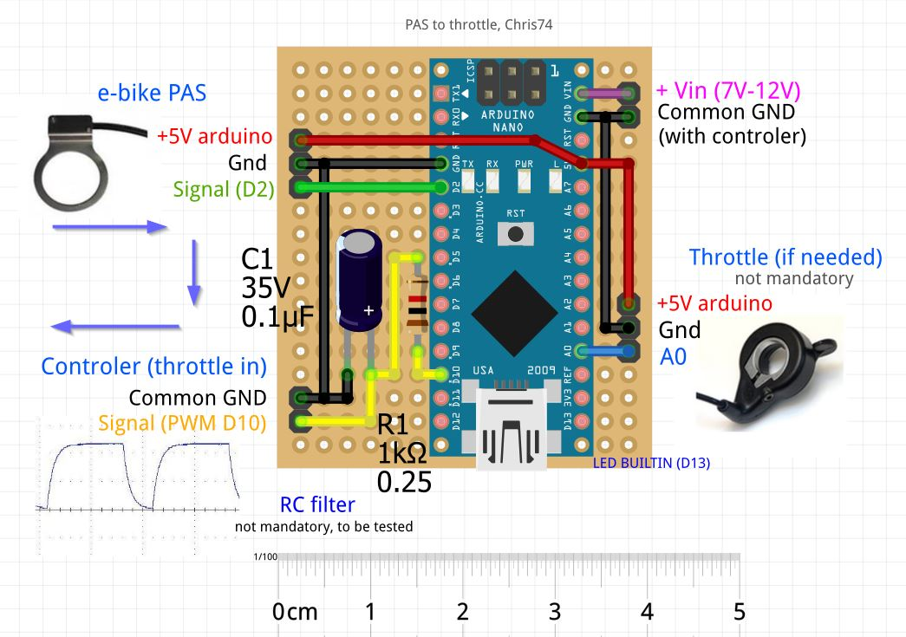
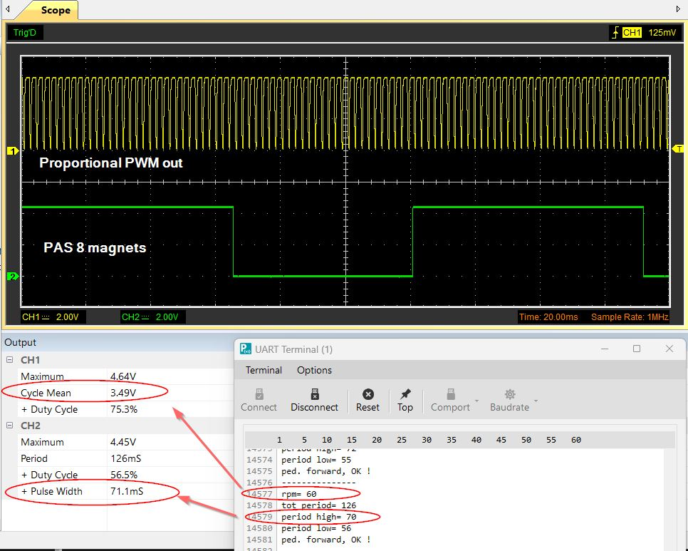

# E-bike PAS to throttle converter
- Conversion de la sortie PAS vers l'entrée throttle (gachette / accélérateur).  
- Possibilité d'utiliser ou non l'assistance proportionnelle en fonction de la vitesse de pédalage.  
- En option inversersion de l'aide  = Plus d'aide en pédalage lent que rapide  
- Le code vérifie le sens de pédalage (pas d'assistance en pédalage arrière !)

 Code pour Aduino Nano/Uno (signal +5V)

**see also**  
- [PAS analyzer](https://github.com/Chris741233/PAS_analyzer)
- [Throttle to PAS](https://github.com/Chris741233/throttle-to-PAS)
- [Button to PAS (with cruise in option)](https://github.com/Chris741233/button-to-PAS)
0

**Discussion sur le forum Cyclurba**  
[Cyclurba](https://cyclurba.fr/forum/forum_discussion.php?from=41&messageID=742211#)

---

 #### Wiring (Arduino Uno/Nano)

<p align="left">
  
</p>

---

#### Utilisation
Régler les constantes en début de code \
*Adjust constants at the beginning of code*

```
-- Setting ---
#define USE_PRPORTIONAL     0   // use proportional assistance ? 1=yes, 0=no (if no, use only On-Off assistance with full PWM)
#define INVERSE_ASSISTANCE  0   // if proportional, inverse assistance ? 1=yes, 0=no (if yes, slow pedaling = more assistance !)
// Si inverse, envois plus d'assistance en pédalage lent qu'en pedalage rapide !

const int  NB_MAGNETS =  6;     // How many magnets on PAS ?  (default 6)

const float V_REF =     5.00;   // Arduino +5V pin reference (=PWM high level) - To test! (default 5.00)
const float V_MIN_THR = 1.10;   // throttle min voltage (default 1.1V --- no push)
const float V_MAX_THR = 3.60;   // throttle max voltage (default 3.6V --- full  push)

const int  RPM_TO_START = 10;   // How many RPM to start assistance ? (with default 10, start is normally fast enough)
// --> more rpm = less ms 

const int START_PULSES  = 0;    // Number of pulses (magnet) needed before turning On (0 = fastest)

// if use_proportional, RPM value for maping PWM out --> cf map() in void turnOn()
const int RPM_MIN = 20;         // min rpm  (default 20rpm)
const int RPM_MAX = 60;         // max rpm  (default 60rpm)

```

#### Oscillo and debug Serial
<p align="left">
  
</p>

<br>

<p align="left">
  
</p>

---

